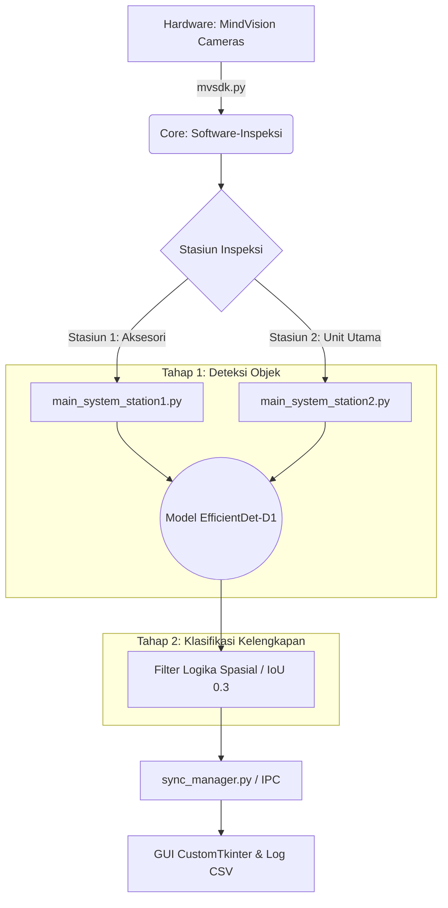

<div align="center">

  <b>Bahasa Indonesia</b> &nbsp;|&nbsp;
  <a href="README_en.md">English</a> &nbsp;|&nbsp;
  <a href="README_ja.md">日本語</a> &nbsp;|&nbsp;
  <a href="README_zh.md">中文</a>

  <br>

  
  
  
  
  
  <br>

  
  
  
  

  <br>

</div>

# Sistem Inspeksi Visual Otomatis Berbasis EfficientDet

Repositori ini merupakan hasil implementasi dari penelitian Tugas Akhir (Skripsi) yang berjudul **"Implementasi EfficientDet untuk Deteksi Komponen dan Klasifikasi Kelengkapan Alat Musik Pianika pada Sistem Inspeksi di PT. XYZ"**.

Sistem ini dirancang untuk mengotomatisasi pengendalian mutu pada tahap pengepakan akhir produk pianika guna meminimalisir risiko kesalahan identifikasi akibat kelelahan manusia (*human error*). 

Proses inspeksi pada perangkat lunak ini beroperasi melalui **dua tahapan utama yang saling berkesinambungan**:
1. **Deteksi Objek (Object Detection):** Model EfficientDet mengidentifikasi dan melokalisasi koordinat dari setiap komponen yang ada di dalam kemasan.
2. **Klasifikasi Kelengkapan (Completeness Classification):** Sistem mengekstrak hasil deteksi objek tersebut, lalu menganalisisnya menggunakan logika spasial untuk mengklasifikasikan apakah kelengkapan paket tersebut berstatus **Lengkap (Pass)** atau **Tidak Lengkap/Cacat Susunan (Fail)**.

---

## Ringkasan Proyek
Penelitian ini mengembangkan sistem inspeksi visual otomatis berbasis kamera ganda yang menggunakan arsitektur *Deep Learning* EfficientDet. Sistem mendeteksi sembilan kategori komponen secara *real-time*.

### Kategori Objek Deteksi:
* **Aksesori**: *Hose* (selang), *Mouthpiece* (corong tiup), Label, Buku Manual, dan *Leaflet*.
* **Unit Utama**: Pianika (Biru/Pink) dan *Case* (Biru/Pink).

---

## Fitur Utama Sistem
* **Integrasi Dual-Station**: Sistem dirancang selaras dengan SOP industri yang mencakup Stasiun 1 (verifikasi aksesori) dan Stasiun 2 (verifikasi unit utama serta tas).
* **Logika Spasial (IoU)**: Selain deteksi objek, sistem menerapkan filter logika spasial berbasis *Intersection over Union* (IoU) dengan ambang batas 0,3 untuk memastikan presisi tata letak komponen sesuai standar perusahaan.
* **Pendekatan Data-Centric**: Menggunakan strategi isolasi objek dan *hard negative samples* (wadah kosong) untuk meningkatkan ketangguhan model terhadap pantulan cahaya dan gangguan visual di pabrik.
* **Performa Kecepatan Tinggi**: Rata-rata waktu tanggap (*latency*) sistem berada di kisaran 0,55 hingga 0,56 detik, memenuhi target produktivitas industri di bawah 2 detik per paket.

---

## Arsitektur Sistem

Alur kerja dirancang untuk memproses tangkapan gambar secara sinkron antara dua stasiun, mendeteksi keberadaan objek menggunakan AI, mengklasifikasikan kelengkapan paket, dan mencatat hasil produksi secara *real-time*.



---

## Performa dan Hasil Eksperimen
Karena arsitektur sistem ini terbagi menjadi dua tahap (*Detection* dan *Classification*), metrik performa dievaluasi secara terpisah pada masing-masing proses untuk memastikan akurasi maksimal di lingkungan industri.

### 1. Evaluasi Tahap Deteksi Objek (Object Detection Metrics)
Metrik ini mengukur seberapa presisi model AI dalam mengenali dan melokalisasi komponen tunggal. Berdasarkan evaluasi internal terhadap 432 sampel citra validasi:
* **mAP@0.50**: 0,9932
* **F1-Score**: 0,9927

### 2. Evaluasi Tahap Klasifikasi Kelengkapan (Completeness Classification Metrics)
Metrik ini mengukur keandalan sistem secara keseluruhan dalam memberikan keputusan akhir (Pass/Fail) setelah hasil deteksi objek diproses oleh algoritma logika spasial.
* **Akurasi Lapangan (Field Accuracy)**: Berdasarkan evaluasi terhadap 2.441 sampel citra operasional yang didapatkan secara langsung di lapangan pabrik:
  * **99,4%** (Akurasi Klasifikasi di Stasiun Aksesori)
  * **97,8%** (Akurasi Klasifikasi di Stasiun Unit Utama)

---

## Struktur Repositori
Proyek ini terbagi menjadi dua modul fungsional utama:

1.  **[Training-EfficientDet](./Training-EfficientDet/)**
    Berisi infrastruktur pengembangan model AI, termasuk strategi akuisisi data adaptif, skrip pelatihan yang dioptimalkan dengan *Automatic Mixed Precision* (AMP) dan *Gradient Accumulation*.

2.  **[Software-Inspeksi](./Software-Inspeksi/)**
    Paket perangkat lunak operasional yang mencakup alat kalibrasi kamera industri, konfigurasi zona referensi (ROI), dan antarmuka pengguna (GUI) utama berbasis *CustomTkinter*.

---

## Spesifikasi Sistem (Hardware Reference)
* **Kamera**: 2 Kamera Industrial HT-SUA501GC-TIV-C (Sensor 2/3" CMOS, 5MP, 40 FPS).
* **Unit Pemrosesan**: Laptop/Mini PC (Intel Core i7, RAM 16GB, GPU NVIDIA RTX 4060 8GB).

---

## Mulai Cepat (Quick Start)

Panduan berikut menunjukkan cara mengatur lingkungan (*environment*) dan menjalankan simulasi perangkat lunak inspeksi tanpa memerlukan perangkat keras kamera fisik.

### 1. Prasyarat
* **Python 3.10**
* Dioptimalkan untuk implementasi **Edge Computing** (seperti Mini PC industri). Penggunaan GPU dengan dukungan CUDA bersifat opsional untuk akselerasi maksimal (*high-throughput*), namun sistem tetap dapat berjalan pada CPU *edge* standar.

### 2. Instalasi
Clone repositori dan instal seluruh pustaka pendukung yang dibutuhkan:

```bash
git clone [https://github.com/Juhenfw/EfficientDet-sistem-inspeksi-visual-otomatis-mvsdk.git](https://github.com/Juhenfw/EfficientDet-sistem-inspeksi-visual-otomatis-mvsdk.git)
cd EfficientDet-sistem-inspeksi-visual-otomatis-mvsdk
pip install -r Training-EfficientDet/requirements.txt
```

### 3. Persiapan Model (*Weights*)
Karena batas ukuran file di GitHub, *pre-trained weights* (file `.pth`) disimpan secara terpisah.
1. Unduh *weights* EfficientDet-D1 dari [Release v1.2.8](https://github.com/Juhenfw/EfficientDet-sistem-inspeksi-visual-otomatis-mvsdk/releases/tag/v1.2.8).
2. Letakkan file `.pth` tersebut di dalam direktori `Software-Inspeksi/models/`.

### 4. Menjalankan Simulasi Sistem
Sistem dilengkapi dengan skrip simulasi menggunakan *dummy data* (gambar sampel lokal) sehingga pengujian antarmuka GUI dan logika integrasi dapat dilakukan tanpa kamera MindVision.

```bash
# Pindah ke direktori perangkat lunak operasional
cd Software-Inspeksi

# Terminal 1: Jalankan simulasi GUI Stasiun 1 (Aksesori)
python main_system_station1_simulation.py

# Terminal 2: Jalankan simulasi GUI Stasiun 2 (Unit Utama)
python main_system_station2_simulation.py
```

---

## Sitasi (Citation)

Jika Anda menggunakan kode atau hasil penelitian dari repositori ini, harap berikan atribusi sesuai format berikut:

**Bahasa Indonesia:**
> Wildan, J. F. (2026). Implementasi EfficientDet untuk Deteksi Komponen dan Klasifikasi Kelengkapan Alat Musik Pianika pada Sistem Inspeksi di PT. XYZ. Skripsi. Surabaya: Universitas Airlangga.

**English:**
> Wildan, J. F. (2026). Implementation of EfficientDet for Component Detection and Completeness Classification of Melodica Musical Instruments in the Inspection System at PT. XYZ. Undergraduate Thesis. Surabaya: Universitas Airlangga.

---

## Penulis
**Juhen Fashikha Wildan**<br>
Program Sarjana Teknik Robotika dan Kecerdasan Buatan<br>
Fakultas Teknologi Maju dan Multidisiplin<br>
**Universitas Airlangga**