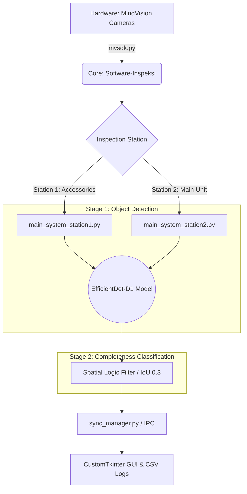

<div align="center">

  <a href="README.md">Bahasa Indonesia</a> &nbsp;|&nbsp;
  <b>English</b> &nbsp;|&nbsp;
  <a href="README_ja.md">日本語</a> &nbsp;|&nbsp;
  <a href="README_zh.md">中文</a>

  <br>

  
  
  
  
  
  <br>

  
  
  
  

  <br><br>

</div>

# Automated Visual Inspection System Based on EfficientDet

This repository contains the implementation of the Undergraduate Thesis titled **"Implementation of EfficientDet for Component Detection and Completeness Classification of Melodica Musical Instruments in the Inspection System at PT. XYZ"**.

This system is designed to automate quality control during the final packaging stage of melodica products to minimize the risk of identification errors due to human fatigue. 

The inspection process in this software operates through **two continuous main stages**:
1. **Object Detection:** The EfficientDet model identifies and localizes the coordinates of each component inside the package.
2. **Completeness Classification:** The system extracts these object detection results and analyzes them using spatial logic to classify whether the package completeness is **Pass (Complete)** or **Fail (Incomplete/Misplaced)**.

---

## Project Summary
This research develops an automated visual inspection system based on dual cameras using the EfficientDet Deep Learning architecture. The system detects nine component categories in real-time.

### Detection Object Categories:
* **Accessories**: Hose, Mouthpiece, Label, Manual Book, and Leaflet.
* **Main Unit**: Melodica (Blue/Pink) and Case (Blue/Pink).

---

## Main System Features
* **Dual-Station Integration**: The system is designed in accordance with industrial SOPs, comprising Station 1 (accessory verification) and Station 2 (main unit and case verification).
* **Spatial Logic (IoU)**: Besides object detection, the system applies a spatial logic filter based on Intersection over Union (IoU) with a threshold of 0.3 to ensure component layout precision meets company standards.
* **Data-Centric Approach**: Utilizes an object isolation strategy and hard negative samples (empty containers) to improve model robustness against light reflections and visual disturbances on the factory floor.
* **High-Speed Performance**: Average system response time (latency) is around 0.55 to 0.56 seconds, meeting the industrial productivity target of under 2 seconds per package.

---

## System Architecture

The workflow is designed to process image frames synchronously across two stations, detect objects using AI, classify package completeness, and log production records in real-time.



---

## Performance and Experimental Results
Because the system architecture is divided into two stages (Detection and Classification), the performance metrics are evaluated separately for each process to ensure maximum accuracy in industrial environments.

### 1. Object Detection Stage Metrics
This metric measures how precisely the AI model recognizes and localizes individual components. Based on an internal evaluation of 432 validation image samples:
* **mAP@0.50**: 0.9932.

### 2. Completeness Classification Stage Metrics
This metric measures the overall reliability of the system in making final decisions (Pass/Fail) after the object detection results are processed by the spatial logic algorithm.
* **F1-Score**: 0.9927 (Based on 432 internal validation samples).
* **Field Accuracy**: Based on an evaluation of 2,441 operational image samples obtained directly from the factory floor:
  * **99.4%** (Classification Accuracy at Accessory Station).
  * **97.8%** (Classification Accuracy at Main Unit Station).

---

## Repository Structure
This project is divided into two main functional modules:

1.  **[Training-EfficientDet](./Training-EfficientDet/)**
    Contains the AI model development infrastructure, including adaptive data acquisition strategies, optimized training scripts with Automatic Mixed Precision (AMP), and Gradient Accumulation.
2.  **[Software-Inspeksi](./Software-Inspeksi/)**
    Operational software package that includes industrial camera calibration tools, region of interest (ROI) configuration, and the main graphical user interface (GUI) based on *CustomTkinter*.

---

## System Specifications (Hardware Reference)
* **Cameras**: 2 Industrial Cameras HT-SUA501GC-TIV-C (2/3" CMOS Sensor, 5MP, 40 FPS).
* **Processing Unit**: Laptop/Mini PC (Intel Core i7, 16GB RAM, NVIDIA RTX 4060 8GB GPU).

---

## Quick Start

The following guide details how to set up the environment and run the inspection software simulation without requiring physical industrial camera hardware.

### 1. Prerequisites
* **Python 3.10**
* Optimized for **Edge Computing** deployment (e.g., industrial Mini PCs). A CUDA-enabled GPU is optional for maximum throughput acceleration, but the system is fully capable of running on standard edge CPUs.

### 2. Installation
Clone the repository and install all required dependencies:

```bash
git clone [https://github.com/Juhenfw/EfficientDet-sistem-inspeksi-visual-otomatis-mvsdk.git](https://github.com/Juhenfw/EfficientDet-sistem-inspeksi-visual-otomatis-mvsdk.git)
cd EfficientDet-sistem-inspeksi-visual-otomatis-mvsdk
pip install -r Training-EfficientDet/requirements.txt
```

### 3. Model Weights Setup
Due to GitHub file size limitations, pre-trained model weights (`.pth` files) are hosted externally.
1. Download the EfficientDet-D1 weights from [Release v1.2.8](https://github.com/Juhenfw/EfficientDet-sistem-inspeksi-visual-otomatis-mvsdk/releases/tag/v1.2.8).
2. Place the downloaded `.pth` file inside the `Software-Inspeksi/models/` directory.

### 4. Running System Simulation
The software includes simulation scripts using dummy sample images, allowing full GUI and IPC integration testing without physical MindVision cameras attached.

```bash
# Navigate to operational software directory
cd Software-Inspeksi

# Terminal 1: Launch Station 1 GUI simulation (Accessories)
python main_system_station1_simulation.py

# Terminal 2: Launch Station 2 GUI simulation (Main Unit)
python main_system_station2_simulation.py
```

---

## Citation
If you use the code or research results from this repository, please provide attribution in the following format:

**Bahasa Indonesia:**
> Wildan, J. F. (2026). Implementasi EfficientDet untuk Deteksi Komponen dan Klasifikasi Kelengkapan Alat Musik Pianika pada Sistem Inspeksi di PT. XYZ. Skripsi. Surabaya: Universitas Airlangga.

**English:**
> Wildan, J. F. (2026). Implementation of EfficientDet for Component Detection and Completeness Classification of Melodica Musical Instruments in the Inspection System at PT. XYZ. Undergraduate Thesis. Surabaya: Universitas Airlangga.

---

## Author
**Juhen Fashikha Wildan**<br>
Bachelor Program in Robotics and Artificial Intelligence Engineering<br>
Faculty of Advanced Technology and Multidiscipline<br>
**Universitas Airlangga**