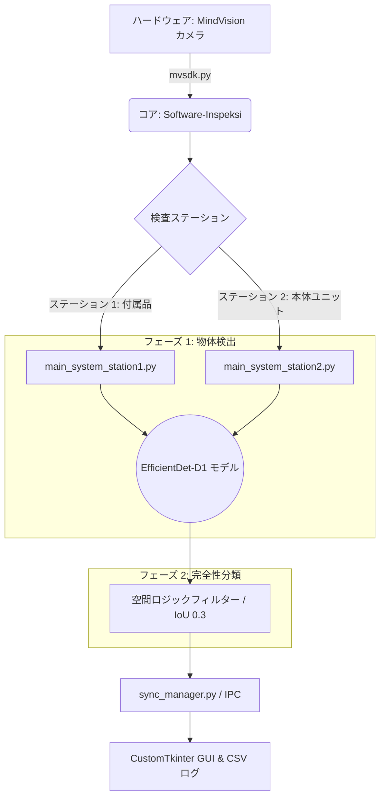

<div align="center">

  <a href="README.md">Bahasa Indonesia</a> &nbsp;|&nbsp;
  <a href="README_en.md">English</a> &nbsp;|&nbsp;
  <b>日本語</b> &nbsp;|&nbsp;
  <a href="README_zh.md">中文</a>

  <br>

  
  
  
  
  
  <br>

  
  
  
  

  <br><br>

</div>

# EfficientDetに基づく自動外観検査システム

本リポジトリは、卒業論文**「PT. XYZの検査システムにおけるピアニカの部品検出および完全性分類のためのEfficientDetの実装」**の研究実装を収録しています。

本システムは、ピアニカ（鍵盤ハーモニカ）製品の最終梱包段階における品質管理を自動化し、作業員の疲労による誤認識リスク（ヒューマンエラー）を最小限に抑えるために設計されました。

本ソフトウェアの検査プロセスは、**2つの連続した主要フェーズ**で構成されています：
1. **物体検出 (Object Detection):** EfficientDetモデルがパッケージ内の各コンポーネントを識別し、その座標を特定します。
2. **完全性分類 (Completeness Classification):** 空間ロジックを用いて物体検出の結果を分析し、パッケージが **完全（Pass）** か **不完全／配置ミス（Fail）** かを分類します。

---

## プロジェクト概要
本研究では、EfficientDetディープラーニングアーキテクチャを採用したデュアルカメラベースの自動外観検査システムを開発しました。システムは9つのコンポーネントカテゴリをリアルタイムで検出します。

### 検出対象カテゴリ：
* **付属品 (Accessories)**: ホース (Hose)、吹口 (Mouthpiece)、ラベル (Label)、取扱説明書 (Manual Book)、リーフレット (Leaflet)。
* **本体ユニット (Main Unit)**: ピアニカ (ブルー/ピンク)、ケース (ブルー/ピンク)。

---

## システムの主な特長
* **デュアルステーション統合**: 産業用SOPに準拠し、ステーション1（付属品検証）およびステーション2（本体ユニット・ケース検証）の2工程で構成されています。
* **空間ロジック (IoU)**: 物体検出に加え、閾値0.3のIntersection over Union (IoU) に基づく空間ロジックフィルターを適用し、企業の品質基準に合わせた正確な配置検証を実現します。
* **データ中心（Data-Centric）アプローチ**: オブジェクト隔離戦略とハードネガティブサンプル（空ケース）を活用し、工場内の光反射や視覚的ノイズに対するモデルの堅牢性を向上させました。
* **高速パフォーマンス**: システムの平均応答時間（レイテンシ）は0.55〜0.56秒であり、産業目標値である「1パッケージあたり2秒未満」を十分にクリアしています。

---

## システムアーキテクチャ

システムワークフローは、2つのステーション間で同期して画像を撮影・処理し、AIで物体を検出し、パッケージの完全性を分類して生産記録をリアルタイムで保存するように設計されています。



---

## 評価と実験結果
システムアーキテクチャが検出と分類の2つの段階に分かれているため、産業環境での精度を確保するためにパフォーマンス指標は各プロセスで個別に評価されます。

### 1. 物体検出フェーズの評価 (Object Detection Metrics)
この指標は、AIモデルが個々のコンポーネントをどの程度正確に認識し、特定できるかを測定します。432枚の検証用画像サンプルに基づく内部評価：
* **mAP@0.50**: 0.9932
* **F1-Score**: 0.9927

### 2. 完全性分類フェーズの評価 (Completeness Classification Metrics)
この指標は、物体検出結果が空間ロジックアルゴリズムによって処理された後、最終決定 (Pass/Fail) を下す際のシステム全体の信頼性を測定します。
* **現場精度 (Field Accuracy)**: 実際の工場現場から収集された2,441枚の運用画像サンプルに基づく評価結果：
  * **99.4%** (付属品ステーションにおける分類精度)
  * **97.8%** (本体ユニットステーションにおける分類精度)

---

## リポジトリ構造
本プロジェクトは主に2つの機能モジュールで構成されています：

1. **[Training-EfficientDet](./Training-EfficientDet/)**
   適応型データ取得戦略、Automatic Mixed Precision (AMP) および Gradient Accumulation によって最適化された学習スクリプトを含む、AIモデル開発インフラ。
2. **[Software-Inspeksi](./Software-Inspeksi/)**
   産業用カメラのキャリブレーションツール、関心領域 (ROI) 設定、CustomTkinterに基づくメインユーザーインターフェース (GUI) を含む運用ソフトウェアパッケージ。

---

## ハードウェア仕様 (Hardware Reference)
* **カメラ**: 産業用カメラ HT-SUA501GC-TIV-C × 2台 (2/3" CMOSセンサー, 5MP, 40 FPS)
* **処理ユニット**: 産業用 Mini PC / ノートPC (Intel Core i7, RAM 16GB, GPU NVIDIA RTX 4060 8GB)

---

## クイックスタート (Quick Start)

以下のガイドでは、物理的な産業用カメラを使用せずに、シミュレーション環境を構築して検査ソフトウェアを実行する手順を説明します。

### 1. 前提条件
* **Python 3.10**
* エッジコンピューティング環境（産業用Mini PC等）向けに最適化されています。高スループット処理のためのCUDA対応GPUは推奨ですが、標準的なエッジCPUでも動作可能です。

### 2. インストール
リポジトリをクローンし、必要な依存ライブラリをインストールします：

```bash
git clone [https://github.com/Juhenfw/EfficientDet-sistem-inspeksi-visual-otomatis-mvsdk.git](https://github.com/Juhenfw/EfficientDet-sistem-inspeksi-visual-otomatis-mvsdk.git)
cd EfficientDet-sistem-inspeksi-visual-otomatis-mvsdk
pip install -r Training-EfficientDet/requirements.txt
```

### 3. モデル重みファイル (.pth) の準備
GitHubのファイルサイズ制限のため、事前学習済みモデルの重みファイルは外部に保存されています。
1. [Release v1.2.8](https://github.com/Juhenfw/EfficientDet-sistem-inspeksi-visual-otomatis-mvsdk/releases/tag/v1.2.8) から EfficientDet-D1 の重みファイルをダウンロードします。
2. ダウンロードした `.pth` ファイルを `Software-Inspeksi/models/` ディレクトリ内に配置します。

### 4. システムシミュレーションの実行
ローカルのサンプル画像を使用したシミュレーションスクリプトが同梱されているため、MindVisionカメラなしでGUIおよびプロセス間通信 (IPC) の動作確認が可能です。

```bash
# 運用ソフトウェアディレクトリへ移動
cd Software-Inspeksi

# ターミナル 1: ステーション1 (付属品) GUIシミュレーションの起動
python main_system_station1_simulation.py

# ターミナル 2: ステーション2 (本体ユニット) GUIシミュレーションの起動
python main_system_station2_simulation.py
```

---

## 引用 (Citation)

本リポジトリのコードや研究結果を使用する場合は、以下のフォーマットで引用してください：

**Bahasa Indonesia:**
> Wildan, J. F. (2026). Implementasi EfficientDet untuk Deteksi Komponen dan Klasifikasi Kelengkapan Alat Musik Pianika pada Sistem Inspeksi di PT. XYZ. Skripsi. Surabaya: Universitas Airlangga.

**English:**
> Wildan, J. F. (2026). Implementation of EfficientDet for Component Detection and Completeness Classification of Melodica Musical Instruments in the Inspection System at PT. XYZ. Undergraduate Thesis. Surabaya: Universitas Airlangga.

---

## 著者
**Juhen Fashikha Wildan**<br>
ロボティクス・人工知能工学科 学士課程<br>
先進技術・マルチディシプリナリー学部<br>
**アイルランガ大学 (Universitas Airlangga)**