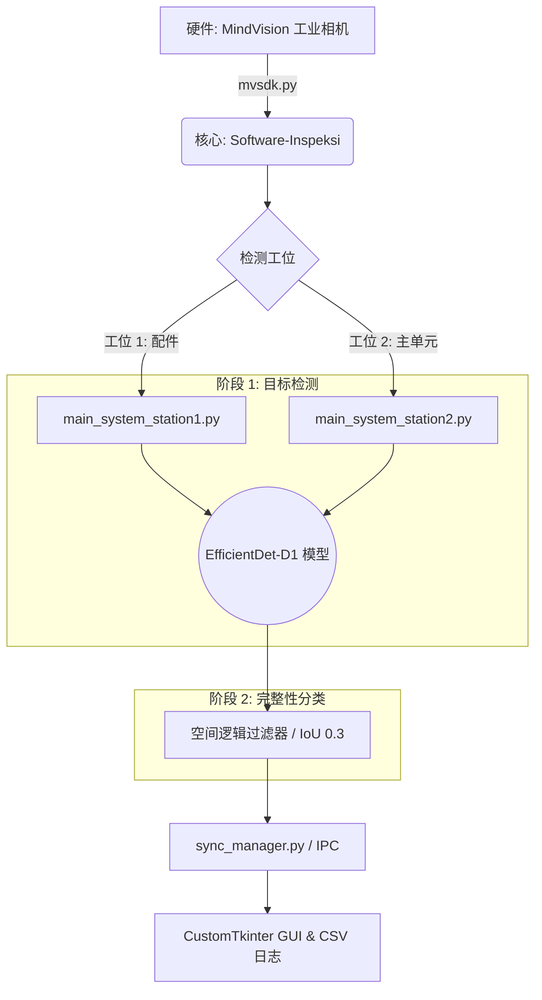

<div align="center">

  <a href="README.md">Bahasa Indonesia</a> &nbsp;|&nbsp;
  <a href="README_en.md">English</a> &nbsp;|&nbsp;
  <a href="README_ja.md">日本語</a> &nbsp;|&nbsp;
  <b>中文</b>

  <br>

  
  
  
  
  
  <br>

  
  
  
  

  <br>

</div>

# 基于 EfficientDet 的自动视觉检测系统

本仓库包含了本科毕业论文**《在 PT. XYZ 检验系统中基于 EfficientDet 的口风琴部件检测与完整性分类实现》**的研究代码与实现。

该系统旨在实现口风琴产品最终包装阶段质量控制的自动化，从而最大程度减少因人工疲劳导致的误判风险（人为错误）。

本软件的检测流程通过**两个连续的核心阶段**运行：
1. **目标检测 (Object Detection):** EfficientDet 模型识别并定位包装内每个部件的坐标。
2. **完整性分类 (Completeness Classification):** 系统提取目标检测结果，利用空间逻辑算法进行分析，从而将包装的完整性分类为 **合格 (Pass)** 或 **不合格/摆放错误 (Fail)**。

---

## 项目概要
本研究开发了一套基于双摄像头的自动视觉检测系统，采用 EfficientDet 深度学习架构。系统可实时检测 9 个部件类别。

### 检测目标类别：
* **配件 (Accessories)**：吹管 (Hose)、吹嘴 (Mouthpiece)、标签 (Label)、说明书 (Manual Book)、宣传页 (Leaflet)。
* **主单元 (Main Unit)**：口风琴（蓝色/粉色）、琴盒（蓝色/粉色）。

---

## 系统核心特性
* **双工位集成**：紧密契合工业 SOP，包含工位 1（配件核验）和工位 2（主单元及琴盒核验）。
* **空间逻辑 (IoU)**：除了目标检测外，系统还应用了基于交并比（IoU，阈值 0.3）的空间逻辑过滤器，确保组件布局精度符合企业标准。
* **以数据为中心 (Data-Centric) 方法**：采用目标隔离策略与难负样本（空盒样本），显著提升模型对工厂光照反射及视觉干扰的鲁棒性。
* **高速性能**：系统平均响应时间（延迟）为 0.55 至 0.56 秒，远优于工业生产中每件包材小于 2 秒的指标要求。

---

## 系统架构

系统工作流设计用于同步处理两个工位的图像采集，利用 AI 模型检测目标对象，对包装完整性进行分类，并实时记录生产日志。



---

## 性能与实验结果
由于系统架构分为检测和分类两个阶段，因此分别对这两个过程进行性能评估，以确保工业环境下的最高准确度。

### 1. 目标检测阶段评估 (Object Detection Metrics)
该指标衡量 AI 模型识别和定位各个部件的精确度。基于 432 张验证集图像样本的内部评估：
* **mAP@0.50**：0.9932
* **F1-Score**：0.9927

### 2. 完整性分类阶段评估 (Completeness Classification Metrics)
该指标衡量目标检测结果经空间逻辑算法处理后，系统在做出最终判断（Pass/Fail）时的整体可靠性。
* **实地准确率 (Field Accuracy)**：基于工厂实地获取的 2,441 张运行图像样本评估：
  * **99.4%**（配件工位分类准确率）
  * **97.8%**（主单元工位分类准确率）

---

## 仓库结构
本项目分为两个主要功能模块：

1. **[Training-EfficientDet](./Training-EfficientDet/)**
   包含 AI 模型开发基础设施，涵盖自适应数据采集策略，以及通过自动混合精度 (AMP) 和梯度累加优化的训练脚本。
2. **[Software-Inspeksi](./Software-Inspeksi/)**
   包含工业相机校准工具、感兴趣区域 (ROI) 配置以及基于 CustomTkinter 的主图形用户界面 (GUI) 的运行软件包。

---

## 硬件规格 (Hardware Reference)
* **相机**：2 台工业相机 HT-SUA501GC-TIV-C（2/3" CMOS 传感器，500万像素，40 FPS）。
* **处理单元**：工业 Mini PC / 笔记本电脑（Intel Core i7，16GB RAM，NVIDIA RTX 4060 8GB GPU）。

---

## 快速开始 (Quick Start)

以下指南介绍了如何在无需连接物理工业相机的情况下，配置环境并运行检测软件的仿真模拟。

### 1. 环境要求
* **Python 3.10**
* 针对**边缘计算**部署（如工业 Mini PC）进行了优化。支持 CUDA 的 GPU 为可选配置（用于最大吞吐量加速），系统同样支持在标准边缘 CPU 上流畅运行。

### 2. 安装步骤
克隆本仓库并安装所需的依赖库：

```bash
git clone [https://github.com/Juhenfw/EfficientDet-sistem-inspeksi-visual-otomatis-mvsdk.git](https://github.com/Juhenfw/EfficientDet-sistem-inspeksi-visual-otomatis-mvsdk.git)
cd EfficientDet-sistem-inspeksi-visual-otomatis-mvsdk
pip install -r Training-EfficientDet/requirements.txt
```

### 3. 模型权重文件 (.pth) 配置
由于 GitHub 文件大小限制，预训练模型权重托管于外部。
1. 从 [Release v1.2.8](https://github.com/Juhenfw/EfficientDet-sistem-inspeksi-visual-otomatis-mvsdk/releases/tag/v1.2.8) 下载 EfficientDet-D1 权重文件。
2. 将下载的 `.pth` 文件放入 `Software-Inspeksi/models/` 目录中。

### 4. 运行系统仿真
软件内置了使用本地示例图像的仿真脚本，无需连接 MindVision 物理相机即可测试 GUI 和进程间通信 (IPC) 的集成逻辑。

```bash
# 进入运行软件目录
cd Software-Inspeksi

# 终端 1：启动工位 1 (配件) GUI 仿真
python main_system_station1_simulation.py

# 终端 2：启动工位 2 (主单元) GUI 仿真
python main_system_station2_simulation.py
```

---

## 引用 (Citation)

如果您在研究或项目中使用了本仓库的代码或结果，请按以下格式进行引用：

**Bahasa Indonesia:**
> Wildan, J. F. (2026). Implementasi EfficientDet untuk Deteksi Komponen dan Klasifikasi Kelengkapan Alat Musik Pianika pada Sistem Inspeksi di PT. XYZ. Skripsi. Surabaya: Universitas Airlangga.

**English:**
> Wildan, J. F. (2026). Implementation of EfficientDet for Component Detection and Completeness Classification of Melodica Musical Instruments in the Inspection System at PT. XYZ. Undergraduate Thesis. Surabaya: Universitas Airlangga.

---

## 作者
**Juhen Fashikha Wildan**<br>
机器人与人工智能工程专业 学士<br>
先进技术与跨学科学院<br>
**艾尔朗加大学 (Universitas Airlangga)**